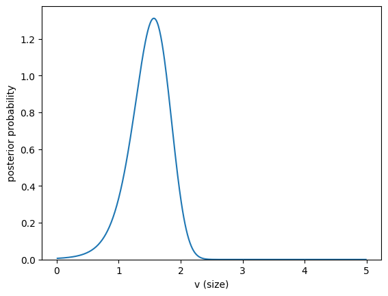
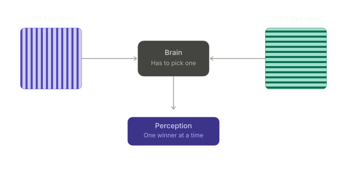
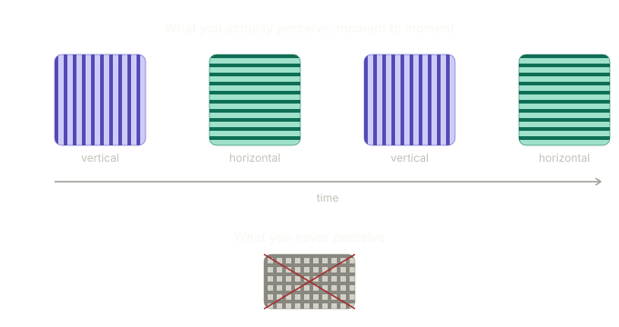
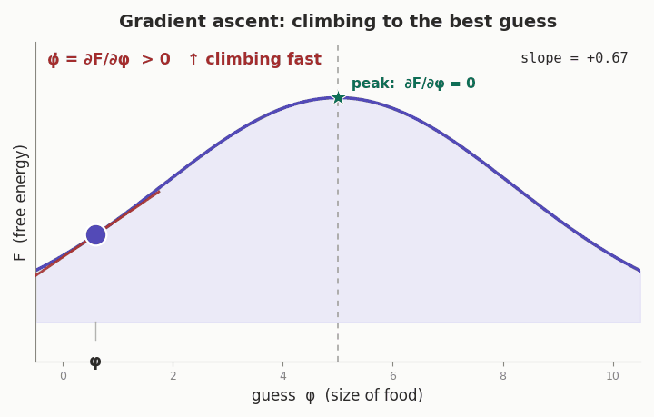

# How to derive Variational Free Energy: A Software Engineers Guide.

[Skip my ramblings, this isn't some hippy cookbook.](#2-the-simplest-case "button")

## 1. Introduction

If you've ever been like me, lying awake at night contemplating how to implement continuous generative models within the framework of Active Inference (**ActInf** - I wanted to use AI but this doesn't need to be any more confusing than it already is) then I'm genuinely surprised because I thought I was weird. In my spare time I am building Active Inference POMDP models with my partner in crime Kev, mostly using the [pymdp](https://github.com/infer-actively/pymdp) python toolbox. Although this toolbox is brilliant and has been a joy to use, it currently doesn't support the creation of Continuous Generative Models (CGMs). This makes my current ultimate goal of creating a Mixed Generative Model (MGM) somewhat more difficult. To do this I need to understand how the fundamental equations of these models are derived, hence this post and subsequent posts. Due to its nature, there isn't a large amount of easily accessible content on Active Inference in general, so whilst learning how to code this stuff, I thought I might as well document it as I go.

So what _is_ Variational Free Energy, before we drown in Greek? It is a mathematically tractable upper bound on sensory "surprise" (or negative log-evidence).

<details>

<summary>

Extra: Variational Free Energy in English

</summary>

In simpler terms: biological systems cannot directly measure how objectively surprising their environment is, because they do not have direct access to the hidden states of the world. Instead, they compute and minimise Variational Free Energy. By minimising VFE, an agent indirectly minimises its sensory surprise.

</details>


> In this derivation we actually **maximise negative VFE** instead of the classic literature move of **minimising positive VFE**. They are approximately identical for the contents of this post.

This post follows the structure of Rafal Bogacz's 2017 paper, _"A tutorial on the free-energy framework for modelling perception and learning"_. Brilliant, but dense enough at times to make this pleb software engineer's to make your eyes water. My job is to slow it right down, swap the heavy notation for runnable Python and plain variable names, and generally make it survivable to an none-academic. It's also the first in a series I'm writing to drag Active Inference into the engineering spotlight.

> _Note_: There will be a lot of acronyms and symbols to deal with in this post. There is an appendix for both.

Our goal is to go from first principles, based on a simple organism, to this monstrosity:

$$
\dot{\phi} \;=\; \frac{\partial F}{\partial \phi} \;=\; \frac{\big(u - g(\phi)\big)\,g'(\phi)}{\Sigma_u} \;-\; \frac{\phi - v_p}{\Sigma_p}
$$

It looks frightening now. By the end it'll look like an old friend who happens to owe you money. The whole thing is just two competing pulls wearing the latest Greek-algebra summer collection, and once you've seen what each piece is doing, the rest is bookkeeping. We'll build it up one honest step at a time, the same way I did in my notebook (mistakes and false starts included, because pretending I got it first try would be dishonest and hopefully you can laugh at me to give your brain a break).

Here's the roadmap. We set up a simple organism trying to guess one number, in this case the size of a food item. We write down the textbook-correct way to solve it, notice that the textbook-correct way involves an integral nobody wants to compute, and then quietly walk away from it. We then do the thing the brain (allegedly) actually does, which is find the single best guess instead of the whole distribution. That shortcut is what gives us Free Energy. Then we differentiate it, get an update rule, and stare at the two terms until they make sense.

---

## 2. The Simplest Case

### 2.1 Setting up the problem

Bogacz starts with a single value of a single variable being inferred by a single observation. One number in, one number out.

The story is this. We have a simple animal (Bogacz uses "animal" so I will too to keep it consistent, but I find "animal" does a lot of heavy lifting) that wants to infer the **size of a food item**. We'll call this size $v$. The animal can't see size directly. What it _can_ do is sense **light intensity**, because it has a single light-sensitive receptor, and bigger things reflect more light. The sensed light intensity is $u$, and crucially $u$ has **noise**.

So our two characters:

- $v$ -- the **size** of the food (the hidden cause we want to infer)
- $u$ -- the **noisy light intensity** the receptor actually reports (the observation)

Now we need to connect them. Light reflected off an object scales with its **area**, so Bogacz picks a nice clean non-linear function relating average light intensity to size:

$$
g(v) = v^2
$$

Keep an eye on that $g$. It's the animal's internal model of "how my sensor responds to the world".

Next, the noise. The animal's receptor doesn't report $g(v)$ exactly; it reports something scattered around it. Bogacz assumes the perceived light intensity is **normally distributed** with mean $g(v)$ and variance $\Sigma_u$. In symbols, the likelihood of an observation given a size is:

$$
p(u \mid v) = f\big(u; \, g(v),\,\Sigma_u\big) \tag{1}
$$

where $f(x; \mu, \Sigma)$ is the density of a **normal distribution** which is shown with this formula:

$$
f(x; \mu, \Sigma) = \frac{1}{\sqrt{2\pi\Sigma}} \, \exp\!\left(-\frac{(x-\mu)^2}{2\Sigma}\right) \tag{2}
$$

Read $f(x; \mu, \Sigma)$ as "the bell curve evaluated at $x$, for a distribution whose mean is $\mu$ and whose variance is $\Sigma$". The semicolon is just separating the value we're plugging in (on the left) from the two settings that define the curve's shape and position (on the right). I'll use the $f$ notation throughout - whenever you see it, it's the same formula, just with different things slotted into the blanks.

> _Side note for Bogacz, and worth repeating here_: a Gaussian isn't really the _right_ distribution for light intensity, because a Gaussian happily applies probabilities to negative numbers and there's no such thing as negative brightness. But it's clean, it's tractable, and it makes the maths behave, so let's just agree to look the other way, for now. This is a recurring theme in modelling: pick the distribution that lets you finish the derivation, apologise in the footnotes.

<details>
<summary>Extra: Why is the mean just g(v)?</summary>

Before moving on I want to justify that "mean $g(v)$" claim, because I'm not a professional academic and it wasn't intuitive to me.

The noisy observation is really the clean prediction $g(v)$ plus some noise, which we notate with an $\omega$:

$$
u = g(v) + \omega, \qquad \omega \sim \mathcal{N}(0, \Sigma_u)
$$

> Don't be fooled by the $\mathcal{N}$, it means the same thing as the $f$ notation, just with the distribution named outright — where $f(x; \mu, \Sigma)$ leaves the distribution generic, $\mathcal{N}(\mu, \Sigma)$ is us saying explicitly "and the distribution here is the Normal (Gaussian) one."

For a fixed $v$, the term $g(v)$ is just a **constant**. There's a handy fact about Gaussians: Adding a constant to a Gaussian random variable just **shifts the mean** by that constant. Formally, if $\omega \sim \mathcal{N}(0, \Sigma_u)$, then $c + \omega \sim \mathcal{N}(c, \Sigma_u)$.

So:

$$
\omega \sim \mathcal{N}(0, \Sigma_u) \;\Rightarrow\; g(v) + \omega \sim \mathcal{N}\big(g(v), \Sigma_u\big)
$$

which is exactly equation (1). In plain English: _"a normal distribution over the variable $u$, with mean $g(v)$ and variance $\Sigma_u$"_. Good. Moving on.

</details>

The last important piece we need for setup is the idea of prior knowledge. A habitual expectation of how big food usually is, before it sees anything at all. This is the bit that makes it Bayesian rather than just "trust the wonky sensor blindly".

For simplicity we assume the animal expects size to be normally distributed too, with mean $v_p$ and variance $\Sigma_p$, where the subscript $p$ stands for **prior**:

$$
p(v) = f(v;\, v_p,\, \Sigma_p) \tag{3}
$$

So now we have both parts that Bayes needs: a **likelihood** $p(u \mid v)$ (how observations relate to causes) and a **prior** $p(v)$ (what we believe before looking).

### 2.2 Stating the result

Here's where we're headed, so you know what the destination looks like before we start the journey.

The exact answer to "given what I saw, how likely is each possible size?" is the **posterior** $p(v \mid u)$, delivered by Bayes' theorem:

$$
p(v \mid u) = \frac{p(v)\, p(u \mid v)}{p(u)} \tag{4}
$$

That's the honest, complete, textbook-correct answer. And as we'll see in a second, it contains a landmine in the denominator. So instead of computing the whole posterior, we'll settle for finding the single **most likely** size (the peak of the posterior) which we'll call $\phi$. The quantity we maximise to find $\phi$ turns out to be (the log of) the numerator of Bayes' rule, and that quantity is what gets called **Free Energy**:

$$
F = \ln p(\phi) + \ln p(u \mid \phi) \tag{5}
$$

Maximise $F$, find your best guess. If your head hurts, don't worry, mine did too — first deriving it myself, then trying to think of how to write about how I derived it. I've got double your headaches...loser.

To make "the peak of the posterior" concrete, here's that curve actually plotted — the exact posterior $p(v \mid u)$ for the food-size example, computed by solving [Bogacz Exercise 1](#appendix-b--bogacz-exercises) ([Python in Appendix C](#appendix-c---python-solutions-to-bogacz-exercises)). This is the whole target: the single value of $v$ sitting under the peak is $\phi$, our best-guess size, and everything from here on is about reaching that peak _without_ computing the whole curve.



### 2.3 Derivation

#### The exact solution, and the integral that we run away from

To work out how likely the range of different sizes $v$ is, given the observed input $u$, we use Bayes' theorem, equation (4) above. The numerator, $p(v)\,p(u \mid v)$, is just prior multiplied by likelihood. The problem is the denominator, $p(u)$.

The denominator is the **normaliser**. It guarantees that the posterior probabilities over all possible sizes integrate to 1. To achieve it, you have to integrate the numerator over every possible size:

$$
p(u) = \int p(v)\, p(u \mid v)\, dv \tag{6}
$$

<details><summary>

Extra: Why do we integrate the numerator to find $p(u)$?

</summary>

$p(u)$ is the probability of receiving that amount of light across every possible cause (in this case size of food $v$). Importantly, the numerator only covers a single food size. The denominator runs across every possible food size, hence the integration. It appears circular, but it's not.

</details>

This is the landmine. For our manufactured simple case with friendly Gaussians, it's doable. _Try Exercise 1 in the Bogacz paper; the Python solution is in [Appendix C](#appendix-c---python-solutions-to-bogacz-exercises) if you get stuck._ In any realistic model (many variables, non-linear $g$) this integral is **intractable** (meaning very difficult or impossible to control, manage, or solve). It's the wall the entire free-energy framework exists to climb over. So rather than smashing our heads against it, we change the question.

#### Finding the most likely value (the MAP shortcut)

Instead of finding the whole curve $p(v \mid u)$, we go after the single value of $v$ that **maximises** $p(v \mid u)$. We call that value $\phi$, our best-guess size, and we call $p(\phi \mid u)$ the **posterior probability density at that point**.

Bogacz notes (and it's a fairly heavy assumption) that it's reasonable to think the brain represents, at any given moment, only the _most likely_ values of features rather than full distributions. The single best guess, not the entire belief. Bogacz uses binocular rivalry as evidence of this assumption. If you don't know what that is, expand the section below.

<details>
<summary>

Extra: Binocular rivalry

</summary>

Here's a rundown of the experiment. You show each eye a _different_ image, say, vertical stripes to the left eye and horizontal stripes to the right eye, at the same time. Crucially, the two images cannot both be true of the same patch of the world. Your brain is now stuck with contradictory evidence and has to make sense of it.



Now, if your brain were tracking the _full distribution_ you'd expect to perceive some sensible average of the two. A blurry grey chequerboard.

**That is not what happens**. What people actually report is that perception _flips_. For a few seconds you see only the vertical stripes, then (without doing anything) it switches and you see only the horizontal stripes, then back again, continuously. You never see the averaged image. Your brain literally picks a winner, commits to it fully, then changes its mind.



That flipping is the tell. It's exactly what you'd expect from a system that represents the single _most likely_ interpretation rather than the whole probability distribution. When the evidence is genuinely ambiguous, there are two roughly-equally-good "best guesses", and the brain ping-pongs between them. It only ever holds _one at a time_.

</details>

This next bit is the pivot the whole derivation hinges on, so I'm going to lay it out slowly. Here's the logic, lightly paraphrased and then broken down:

> We look for the value $\phi$ which maximises the posterior $p(\phi \mid u)$. By equation (4), that posterior depends on a ratio of two quantities, but the denominator $p(u)$ does not depend on $\phi$. Therefore the value of $\phi$ that maximises the posterior is the same value that maximises the **numerator**. We denote the logarithm of that numerator by $F$ (it's related to negative free energy, as we'll see).

Let me unpack that, because it's doing three separate clever things at once:

- **"We look for a value which maximises..."** - The animal wants its single best guess for food size. This is the peak of the curve from before. Instead of calculating the whole curve, it just wants to know _where the top is_.

- **"The posterior depends on a ratio, but the denominator doesn't depend on $\phi$."** - Bayes' rule is `prior x likelihood / normaliser`. That normaliser, $p(u)$, is the integral. But **it does not depend on the guess $\phi$.** It's a fixed number once $u$ is observed.

- **"Thus the value which maximises it is the same one which maximises the numerator."** - This is the crux. Dividing everything by the same constant just **rescales** the curve; it doesn't move where the peak _is_. Like that one friend at a party that's a downer. They don't change the location of the party but they bring everybody down. So we can completely ignore that friend, I mean, the hard-to-compute denominator $p(u)$, and just maximise the numerator, keeping the party alive. The location of the maximum is unchanged.

Then one final convenience: we take the **log** of the numerator before maximising. This is safe because log is **monotonic** (a fancy way of saying it never reorders things, so it also doesn't move the peak). Like everyone wearing a hat at the party...something something...worn out party analogy. If $a > b$ then $\ln a > \ln b$, always. Taking logs also turns all our products into sums (via $\ln(ab) = \ln a + \ln b$), which is going to make the calculus nicer in about thirty seconds.

**In summary:** the denominator is fixed scaling that does not affect where the peak is, so we throw it away. We take the log of what's left (products become sums, peak stays put), and we call the result $F$, for Free Energy, and we maximise that.

That gives us equation (7):

$$
F = \ln p(\phi) + \ln p(u \mid \phi) \tag{7}
$$

Two terms: the log-prior and the log-likelihood. That's the whole objective. Now we substitute in the actual Gaussians and grind.

#### Substituting in the Gaussians (a wall of maths, honestly)

<aside>

**Log identities (recall)**

- Product rule: $\ln(ab) = \ln a + \ln b$
- Power rule: $\ln(b^x) = x \ln b$
- Quotient rule: $\ln\!\left(\frac{x}{y}\right) = \ln x - \ln y$

</aside>

The plan: Take equation (7), sub in the prior (3) and the likelihood (1), each of which is the Gaussian density (2), and simplify using log rules until something clean falls out. Bogacz basically says "do this" and then shows a wall of algebra. So here's that wall. Feel free to try it out yourself.

Starting from (7) and substituting the two Gaussian densities:

$$
F = \ln\!\left[\frac{1}{\sqrt{2\pi\Sigma_p}} \exp\!\left(-\frac{(\phi - v_p)^2}{2\Sigma_p}\right)\right] + \ln\!\left[\frac{1}{\sqrt{2\pi\Sigma_u}} \exp\!\left(-\frac{(u - g(\phi))^2}{2\Sigma_u}\right)\right]
$$

Each $\ln$ of a product splits into a log of the front fraction plus a log of the exponential. The log of an exponential is just its exponent, so the $\exp$ and $\ln$ annihilate and leave the quadratic behind:

$$
F = \ln\!\left(\frac{1}{\sqrt{2\pi\Sigma_p}}\right) - \frac{(\phi - v_p)^2}{2\Sigma_p} \;+\; \ln\!\left(\frac{1}{\sqrt{2\pi\Sigma_u}}\right) - \frac{(u - g(\phi))^2}{2\Sigma_u}
$$

Now look at those two leftover log terms, $\ln\!\left(\frac{1}{\sqrt{2\pi\Sigma_p}}\right)$ and $\ln\!\left(\frac{1}{\sqrt{2\pi\Sigma_u}}\right)$. We're eventually going to **differentiate $F$ with respect to $\phi$**. Neither of those terms contain a $\phi$. So when we differentiate, they vanish.

So Bogacz groups them into a single constant term $C$:

$$
F = \frac{1}{2}\left[-\ln\Sigma_p - \frac{(\phi - v_p)^2}{\Sigma_p} - \ln\Sigma_u - \frac{(u - g(\phi))^2}{\Sigma_u}\right] + C \tag{8}
$$

<details>
<summary>

Extra: If you want to see where that $\tfrac12$ and the $-\ln\Sigma$ bits come from

</summary>

$\ln\!\left(\frac{1}{\sqrt{2\pi\Sigma}}\right) = \ln(2\pi\Sigma)^{-1/2} = -\tfrac{1}{2}\ln(2\pi\Sigma) = -\tfrac12\ln(2\pi) - \tfrac12\ln\Sigma$, and the $-\tfrac12\ln(2\pi)$ part is a pure constant that disappears into $C$. The $-\tfrac12\ln\Sigma$ terms stick around in the expression but, since the variances are fixed in our case, they're also constant with respect to $\phi$. The full expanded form, with the $\Sigma$-logs written out properly, lives in [Appendix A](#appendix-a--the-full-algebra) for everyone who wants every step.

</details>

That's our objective function. A log-prior penalty, a log-likelihood penalty, and a constant we'll never think about again. Well done, go grab a drink.

> _Confession_: the first time I did this I tried to expand all the $\ln\!\left(\frac{1}{\sqrt{2\pi\Sigma}}\right)$ terms out fully — splitting them into $-\tfrac{1}{2}\ln(2\pi\Sigma)$, then into $-\tfrac{1}{2}\ln(2\pi) - \tfrac{1}{2}\ln\Sigma$, and so on, dragging every $2\pi$ along for the ride. I filled half a page, wrote "**Wrong, started again**" in big letters, and underlined it. It wasn't actually _wrong_, it was just a waste of effort, because all those $2\pi$ bits are about to get swept into a constant anyway. Learn from my pain: don't expand things you're about to throw away.

#### Differentiating to get the update rule

We've got $F$ as a function of our guess $\phi$. To find the $\phi$ that maximises it, we need the gradient $\frac{\partial F}{\partial \phi}$. The constant $C$ goes away. The two $-\ln\Sigma$ terms also go, since they don't contain a $\phi$ either. That leaves the two quadratics.

Differentiating $-\frac{(\phi - v_p)^2}{2\Sigma_p}$ with respect to $\phi$ gives $-\frac{(\phi - v_p)}{\Sigma_p}$, which flips to $\frac{v_p - \phi}{\Sigma_p}$.

The second term, $-\frac{(u - g(\phi))^2}{2\Sigma_u}$, needs the **chain rule**, because $g(\phi)$ is a function tucked inside another function.

<aside>
When you differentiate a function-of-a-function, you multiply by the derivative of the inner one. 
</aside>

The inner function is $g(\phi)$, so its derivative $g'(\phi)$ gets pulled out front. Working it through gives $\frac{(u - g(\phi))}{\Sigma_u} \cdot g'(\phi)$.

Putting both together:

$$
\frac{\partial F}{\partial \phi} = \frac{v_p - \phi}{\Sigma_p} + \frac{u - g(\phi)}{\Sigma_u}\, g'(\phi) \tag{9}
$$

> Quick note on that $g'(\phi)$ - it matters _enormously_. Remember the animal's sensor model was $g(v) = v^2$. So:
>
> $$
> g(\phi) = \phi^2 \quad\Rightarrow\quad g'(\phi) = 2\phi
> $$
>
> This is the **only place** the specific shape of the sensor enters the update. Swap in a different $g$ and _only_ $g'(\phi)$ changes - everything else in the equation is structural.

#### Gradient ascent: letting the guess move

Equation (9) tells us the slope of $F$ at our current guess. To actually _find_ the peak, we apply **gradient ascent**. Bogacz writes it about as simple as it can be written:

$$
\dot{\phi} = \frac{\partial F}{\partial \phi}
$$

In English this means "let your guess $\phi$ change over time at the rate of the gradient". If $F$ slopes upwards at your current guess, $\dot\phi$ is positive and $\phi$ moves in the upward direction. At the peak, $\frac{\partial F}{\partial\phi} = 0$, so $\dot\phi = 0$, and the guess stops moving. It's settled on the best estimate.



> **Worth flagging:** this is gradient _ascent_, not descent — notice there's no minus sign. But hang on, doesn't everyone bang on about _minimising_ free energy? They do, and there's no contradiction; it's a naming mismatch that we addressed in an earlier paragraph. The quantity we've been building, $F$, came straight out of logging the _numerator_ of Bayes' rule, so it's a goodness score we want to push _up_ (most probable guess = top of the hill). The free energy the literature tells you to minimise is defined the other way up, as a proxy for _surprise_, which you obviously want _down_. The two are just negatives of each other: $F_{\text{literature}} \approx -F_{\text{ours}}$. Climbing our hill _is_ descending their valley. Bogacz didn't flip his terms to match the convention because his derivation hands him this version for free; negating everything by hand just to agree with a sign convention would've added minus signs to every equation that follows, for zero benefit. So: we ascend, and we call it negative free energy to keep our consciences clear.

#### The two terms and their meaning

We're going to take a break from the algebra for a second and go back to the narrative. The update to $\phi$ is driven by two terms in equation (9). The first pulls the guess towards the prior; the second pulls it according to the sensory input. Let's take a minute to recap each.

$$
\underbrace{\frac{v_p - \phi}{\Sigma_p}}_{\textbf{Term 1}} \qquad\qquad \underbrace{\frac{u - g(\phi)}{\Sigma_u}\, g'(\phi)}_{\textbf{Term 2}}
$$

<div class="cols">
<div class="col">

**Term 1 - the pull towards prior expectation**

- $v_p$ - the **prior mean**. What the animal expected the size to be before "seeing" anything. It's habitual beliefs.
- $\phi$ - the **current guess**.
- $v_p - \phi$ - how far the current guess is from what we expected. A **discrepancy**, sometimes referred to as a distance in the literature.
- $\Sigma_p$ - the **prior variance**, i.e. the uncertainty in that prior expectation.

So Term 1 says: _if your current guess has drifted away from your habitual belief, get pulled back towards it_. The strength of that pull is scaled with how confident the prior is. A tight prior (small $\Sigma_p$) has a larger influence; a vague prior (big $\Sigma_p$) has less influence.

</div>
<div class="col">

**Term 2 - the pull towards the observation.**

- $u$ - the **actual sensory observation**. The light intensity the animal really observed.
- $g(\phi)$ - what the animal _would expect_ to observe if its current guess $\phi$ were true. The sensory model is $g(\phi) = \phi^2$.
- $u - g(\phi)$ - the **prediction error**. What it saw minus what it predicted it would see given its best guess. In predictive coding, this discrepancy between reality and expectation _is_ the signal that drives learning.
- $\Sigma_u$ - the **sensory variance**, i.e. how noisy the sensor is. Large $\Sigma_u$ -> the sensor is bad, low trust; small $\Sigma_u$ -> the sensor is good, high trust.
- $g'(\phi)$ - the **chain-rule factor** ($2\phi$ in our case). It does a units conversion: the prediction error lives in _observation units_ (luminance, for example), and $g'(\phi)$ translates it into a correction in _size units_ ($m^2$, for example).

So Term 2 says: _look at the gap between what you observed and what you predicted, scale it down if your sensor is unreliable, convert it into size-language, and influence your guess in that direction_.

</div>
</div>

That's the whole engine. The animal's belief is a tug-of-war between **"this is what I usually expect"** (the prior) and **"this is what I'm actually seeing right now"** (the evidence), each weighted by how much it trusts the respective source. Inference is just letting that tug-of-war settle. Stitch the two terms back together and you've got the monstrosity from the very top of the post:

$$
\dot{\phi} \;=\; \frac{\big(u - g(\phi)\big)\,g'(\phi)}{\Sigma_u} \;-\; \frac{\phi - v_p}{\Sigma_p}
$$

## Appendix A — The full algebra

For completeness, here's the full expansion I shortcut in the main text. If you want every $2\pi$ accounted for rather than swept into $C$, this is for you.

Start from equation (7) with both Gaussians substituted in. Take one term at a time. Using $\ln(ab) = \ln a + \ln b$ on the prior term:

$$
\ln\!\left[\frac{1}{\sqrt{2\pi\Sigma_p}} \exp\!\left(-\frac{(\phi - v_p)^2}{2\Sigma_p}\right)\right] = \ln\!\left(\frac{1}{\sqrt{2\pi\Sigma_p}}\right) - \frac{(\phi - v_p)^2}{2\Sigma_p}
$$

Now expand that front log. Rewrite the fraction as a power, $\frac{1}{\sqrt{2\pi\Sigma_p}} = (2\pi\Sigma_p)^{-1/2}$, and pull the exponent out with $\ln(b^x) = x\ln b$:

$$
\ln\!\left(\frac{1}{\sqrt{2\pi\Sigma_p}}\right) = -\tfrac{1}{2}\ln(2\pi\Sigma_p)
$$

Split the product inside with $\ln(ab) = \ln a + \ln b$ again:

$$
-\tfrac{1}{2}\ln(2\pi\Sigma_p) = -\tfrac{1}{2}\ln(2\pi) - \tfrac{1}{2}\ln\Sigma_p
$$

The $-\tfrac{1}{2}\ln(2\pi)$ piece contains no $\phi$ and no variance worth tracking — it's a pure constant. The same expansion applies identically to the likelihood term with $\Sigma_u$ and $g(\phi)$ in place of $\Sigma_p$ and $v_p$. Doing both and collecting:

$$
F = \ln\!\left(\tfrac{1}{\sqrt{2\pi}}\right) - \tfrac{1}{2}\ln\Sigma_p - \frac{(\phi - v_p)^2}{2\Sigma_p} \;+\; \ln\!\left(\tfrac{1}{\sqrt{2\pi}}\right) - \tfrac{1}{2}\ln\Sigma_u - \frac{(u - g(\phi))^2}{2\Sigma_u}
$$

The two $\ln\!\left(\tfrac{1}{\sqrt{2\pi}}\right)$ terms are constants. Roll them — and only them — into $C$, factor out the $\tfrac12$, and you land exactly on the boxed result from the main text:

$$
F = \frac{1}{2}\left[-\ln\Sigma_p - \frac{(\phi - v_p)^2}{\Sigma_p} - \ln\Sigma_u - \frac{(u - g(\phi))^2}{\Sigma_u}\right] + C
$$

The moral, again: the $\Sigma$-logs survive the simplification but disappears under differentiation (they're constant in $\phi$ when precisions are fixed), and the $2\pi$ junk was never worth carrying. Expand only what you need.

## Appendix B — Bogacz Exercises

Bogacz peppers the tutorial with exercises, and they're genuinely worth doing. They're the difference between following along and actually building the thing. I left them out of the main flow to not repeat their work and to keep this easier to read. But I would recommend taking a look at them yourself. They live in the relevant chapters of the tutorial:

- **Exercise 1** (Chapter 2) — plotting the exact posterior $p(v \mid u)$ for the food-size example. This is the curve whose peak we spent the whole post chasing.
- **Exercise 2** (Chapter 2.2 / 2.3) — implementing the gradient ascent on $\phi$ and watching it converge.

My solutions, written in Python, can be seen in [Appendix C](#appendix-c---python-solutions-to-bogacz-exercises)

## Appendix C - Python solutions to Bogacz Exercises

```python

import matplotlib.pyplot as plt
import numpy as np
from scipy.stats import norm


def exercise_1():
    v_p = 3
    sigma_p = 1
    sigma_u = 1

    u = 2

    vrange = np.arange(0.01,5,0.01)

    numerator = norm.pdf(vrange, v_p, sigma_p) * norm.pdf(u, vrange**2, sigma_u) # Posterior = Prior * likelihood
    denominator = sum(numerator*0.01)
    p = numerator/denominator

    plt.plot(vrange, p)
    plt.ylim(ymin=0)
    plt.xlabel("v (size)")
    plt.ylabel("posterior probability")
    plt.show()

exercise_1()
```

```python
import matplotlib.pyplot as plt
import numpy as np


def exercise_2():
    v_p = 3
    sigma_p = 1
    sigma_u = 1

    u = 2

    phi=[]
    phi: list[int|float] = [v_p]
    Dt = 0.01
    max_t = 5
    n_steps = int(max_t/Dt)

    for _ in range(n_steps):
        current = phi[-1]
        prior_expectation_pull = (v_p - current)/sigma_p
        observation_pull = ((u - current**2)/sigma_u)*2*current

        # Using Euler's method phi(t+Dt) = phi(t) + Dt*(dF/dphi)
        phi.append(current + Dt*(prior_expectation_pull+observation_pull))

    time = np.arange(len(phi)) * Dt

    plt.plot(time, phi, "k")
    plt.ylim(ymin=0)
    plt.xlabel("time")
    plt.ylabel(r"$\phi$ (guess of v)")
    plt.show()

exercise_2()
```

## Notation Summary

As promised up top, here's the appendix for the symbols and acronyms. Skim it once now if you like, or just flick back whenever a piece of Greek catches you out.

### Acronyms

| Acronym | Stands for                                                          |
| ------- | ------------------------------------------------------------------- |
| VFE     | Variational Free Energy — the quantity this whole post derives      |
| ActInf  | Active Inference (my abbreviation, to avoid clashing with "AI")     |
| POMDP   | Partially Observable Markov Decision Process                        |
| CGM     | Continuous Generative Model                                         |
| MGM     | Mixed Generative Model                                              |
| MAP     | Maximum A Posteriori — the single most-likely estimate (our $\phi$) |
| pymdp   | The Python active-inference toolbox I build models with             |

### Symbols

| Symbol              | Meaning                                                                                                                                          |
| ------------------- | ------------------------------------------------------------------------------------------------------------------------------------------------ |
| $v$                 | True size of the food item (the hidden cause we want to infer)                                                                                   |
| $u$                 | Observed (noisy) light intensity — the sensory input                                                                                             |
| $\phi$              | The animal's current best guess at the size; the value that maximises the posterior                                                              |
| $\dot{\phi}$        | Rate of change of the guess over time (gradient ascent)                                                                                          |
| $g(\cdot)$          | The sensory/generative model relating size to expected light intensity; here $g(v) = v^2$                                                        |
| $g'(\cdot)$         | Derivative of the sensory model; here $g'(\phi) = 2\phi$. The chain-rule factor converting prediction error from observation units to size units |
| $v_p$               | Prior mean — the size the animal habitually expects before observing anything                                                                    |
| $\Sigma_p$          | Prior variance — uncertainty in the prior expectation                                                                                            |
| $\Sigma_u$          | Sensory variance — how noisy the sensor is (large = untrustworthy, small = reliable)                                                             |
| $\omega$            | Sensory noise, $\omega \sim \mathcal{N}(0, \Sigma_u)$                                                                                            |
| $f(x; \mu, \Sigma)$ | Density of a normal distribution with mean $\mu$ and variance $\Sigma$                                                                           |
| $p(v)$              | Prior over size                                                                                                                                  |
| $p(u \mid v)$       | Likelihood of an observation given a size                                                                                                        |
| $p(v \mid u)$       | Posterior over size given the observation (what Bayes gives us)                                                                                  |
| $p(u)$              | Model evidence / normaliser — the intractable integral we avoid                                                                                  |
| $F$                 | Free Energy — the log-numerator of Bayes' rule that we maximise                                                                                  |

## References

1. Bogacz, R. (2017). A tutorial on the free-energy framework for modelling perception and learning. _Journal of Mathematical Psychology_, 76, 198–211.

2. Da Costa, L., Parr, T., Sajid, N., Veselic, S., Neacsu, V., & Friston, K. (2020). Active inference on discrete state-spaces: A synthesis. Journal of Mathematical Psychology, 99, 102447.

3. Smith, R., Friston, K. J., & Whyte, C. J. (2022). A step-by-step tutorial on active inference and its application to empirical data. Journal of Mathematical Psychology, 107, 102632.
